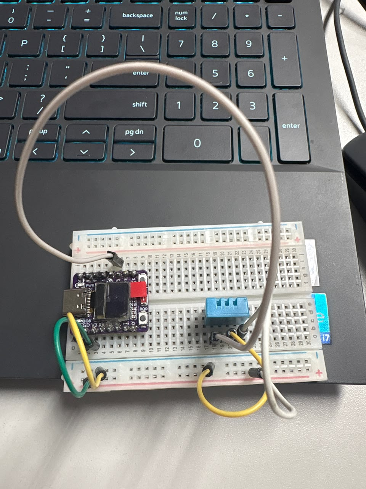

# 🌡️ Monitoramento Microclimático com ESP32-C3 (Nó Sensor Edge)

**Equipe:** Homero, Joelson, Lucas Ximenes, Nicollas, Thayanne, João Cesar e Morgana.

## 📋 Sobre o Projeto
Protótipo de IoT (Nó Sensor Edge) desenvolvido para a telemetria inicial de temperatura e umidade. O projeto utiliza um microcontrolador ESP32-C3 que processa os dados de um sensor DHT22 e os disponibiliza em uma interface Web acessível via navegador em qualquer dispositivo na mesma rede Wi-Fi, servindo como fonte de ingestão de dados.

## 📸 Registro Fotográfico do Artefato (Upcycling)
O gabinete (enclosure) foi construído aplicando princípios de Design Circular / Maker (Upcycling), utilizando embalagens reaproveitadas para acomodar a eletrônica e garantir a troca de ar convectiva.



## 🛠️ Componentes Utilizados
* Placa de desenvolvimento ESP32-C3
* Sensor de Temperatura e Umidade DHT22
* Protoboard e cabos jumper
* Gabinete de material reaproveitado (Upcycling)

## 🔌 Esquema de Ligação
* **Pino VCC (DHT22)** -> Conectado ao **3V3** do ESP32
* **Pino DATA (DHT22)** -> Conectado ao pino **GPIO 5** do ESP32
* **Pino GND (DHT22)** -> Conectado ao pino **GND** do ESP32

## 🚀 Como Executar o Projeto

1. Faça o clone deste repositório.
2. Crie um arquivo chamado `credentials.h` na mesma pasta do arquivo `.ino` e insira o seguinte código para proteger suas senhas:
   ```cpp
   #ifndef CREDENTIALS_H
   #define CREDENTIALS_H

   const char* WIFI_SSID = "Sua_Rede_WiFi";
   const char* WIFI_PASS = "Sua_Senha_WiFi";

   #endif
   ```
3. Abra o arquivo `monitoramento.ino` na IDE Arduino (certifique-se de ter a placa **ESP32C3 Dev Module** e a biblioteca **DHT sensor library** instaladas).
4. Faça o upload do código para a placa.
5. Abra o Monitor Serial (115200 baud). Após conectar ao Wi-Fi, o IP local será exibido.
6. Cole esse IP no navegador de qualquer dispositivo conectado na mesma rede para visualizar a interface.

## 📌 Memorial Descritivo e Justificativa de Engenharia
* **Aplicação no Negócio:** Este nó sensor edge foi projetado para atuar no monitoramento microclimático do ecossistema do agronegócio (ex: câmaras de resfriamento rápido de uva/manga ou packing houses no Vale do São Francisco).
* **Fluxo de Funcionamento:** O código realiza a leitura periódica dos dados analógicos do DHT22 e hospeda um servidor web interno. Qualquer requisição HTTP na porta 80 do IP do dispositivo renderiza uma interface HTML com a telemetria em tempo real.
* **Limitações Técnicas Identificadas:**
  * *Sensor:* Embora o DHT22 seja superior ao DHT11, ele ainda não possui robustez industrial contra condensação extrema presente em câmaras frias reais, podendo apresentar saturação.
  * *Conectividade:* A comunicação Wi-Fi em galpões industriais sofre com interferência de barreiras metálicas e alto consumo de energia.
  * *Carcaça:* O material reaproveitado é sustentável, mas carece de certificação IP (Ingress Protection) oficial contra lavagens sanitárias.

## ☁️ Próximos Passos (Integração Cloud)
Para a infraestrutura em nuvem definitiva do PI, o modelo de servidor web local será substituído por protocolos de telemetria ativa (como MQTT ou HTTP REST) enviando dados para provedores de nuvem (AWS/Azure). Isso permitirá armazenamento de longo prazo em bancos de dados (Time Series) e integração com modelos preditivos para analisar o padrão fitossanitário e prever a qualidade da safra.